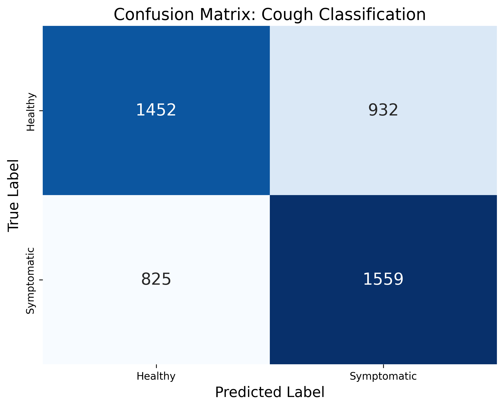

## 📊 Project Results

### Model Performance
The model was trained using a Bottleneck CNN architecture to ensure high generalization across noisy crowdsourced audio data.

*The confusion matrix shows our focus on maximizing Recall for symptomatic cases.*

### Acoustic Feature Engineering
We use a 3-channel approach to capture the temporal dynamics of respiratory sounds:
1. **Static:** Mel Spectrogram
2. **Delta:** Spectral Velocity
3. **Delta-Delta:** Spectral Acceleration

## 🚀 API Deployment
The project includes a FastAPI wrapper that provides real-time inference.

- **Endpoint:** `POST /predict`
- **Containerization:** Docker-ready for cross-platform deployment.